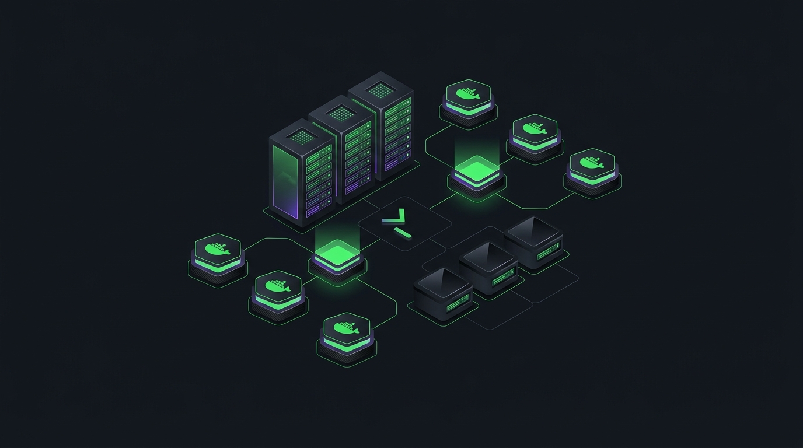
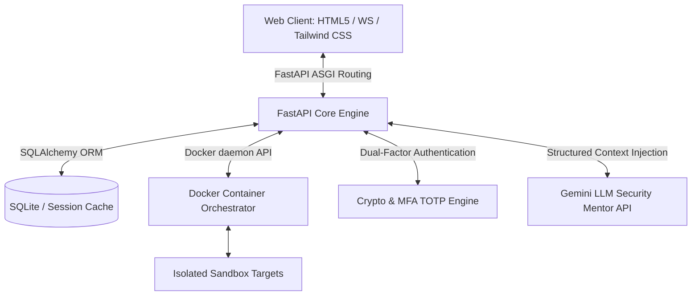

# SECURITHON LAB // Enterprise Cyber-Range Architecture



Securithon Lab is a production-grade, asynchronous cyber-range emulation platform designed for automated threat simulation, live vulnerability analysis, and defensive code-level verification (AppSec). By deploying isolated containerized micro-architectures (sandboxes), the platform simulates realistic attack vectors, providing security engineers with an active environment to analyze system vulnerabilities, implement defensive patches, and execute automated regression audits.

---

## 🏛️ System Architecture & Data Flow

The platform relies on a highly decoupled, asynchronous, API-first architecture. It integrates non-blocking network I/O, container virtualization, and cryptographic session verification.



### Architectural Subsystems
- **Asynchronous Execution Layer (FastAPI & Uvicorn)**: Handles high-concurrency client sessions, real-time logging, and WebSocket terminal streams without blocking main event loops.
- **Dynamic Virtualization Sandbox Orchestrator**: Directly interfaces with the Docker daemon API to provision, monitor, and tear down isolated target containers dynamically based on active scenarios.
- **Cryptographic & Session Hardening Engine**: Manages secure session cookies, JWT token validation (HS256), CSRF token lifecycle, and RFC 6238-compliant TOTP multi-factor authentication (MFA).
- **Context-Aware AI Mentorship Integrator**: Formulates and structures telemetry metadata from active challenge containers to provide real-time, sandbox-specific AI guidance via the Gemini API.

---

## 📂 Structural Codebase Organization

```
SECURITHON-LAB_007/
├── app/
│   ├── api/v1/          # RESTful endpoints (Auth, System, Sandbox, Terminals)
│   ├── core/            # Security middleware, JWT codecs, and environment configurations
│   ├── crud/            # Database abstraction and CRUD transactions
│   ├── db/              # SQLAlchemy session pools and schema migrations
│   ├── middleware/      # CSRF validation and response header security policy enforcement
│   ├── models/          # SQLAlchemy relational database schemas
│   ├── schemas/         # Pydantic data validation and serialization schemas
│   ├── services/        # Docker validation logic and AI mentor context managers
│   ├── static/          # CSS assets, JS modules, and client-side terminal logic
│   └── templates/       # Modular Jinja2 layout files and glassmorphic components
└── docker_files/        # Blueprints and Dockerfiles for target sandboxes
```
